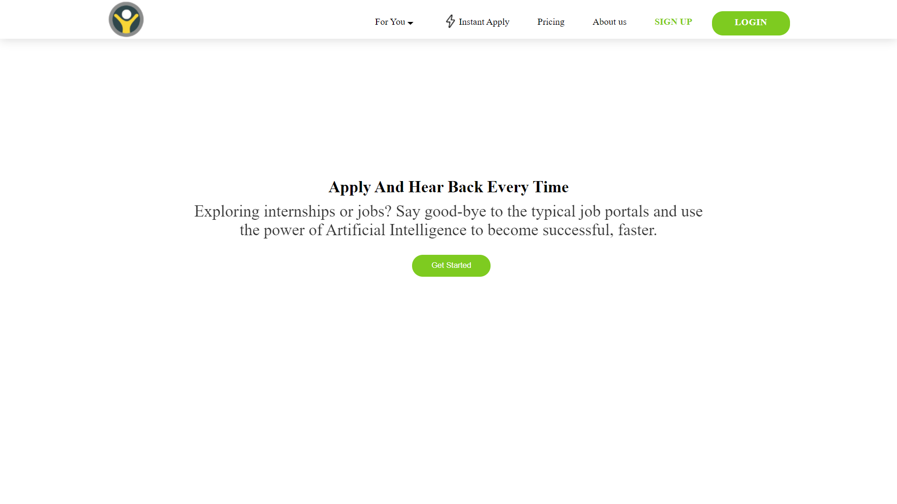
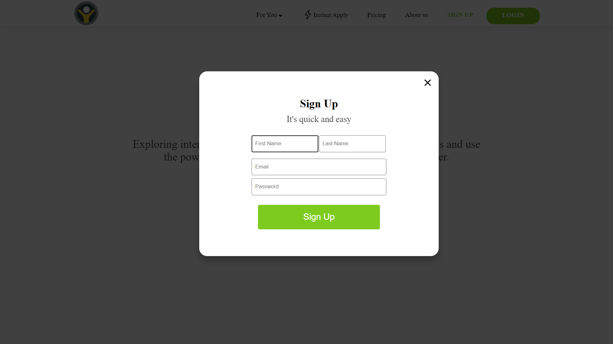
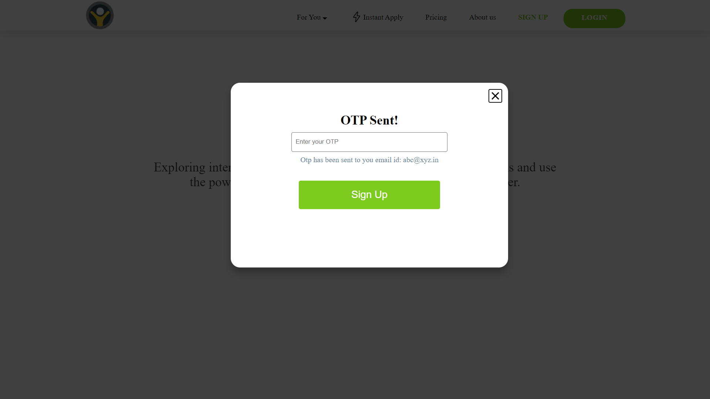
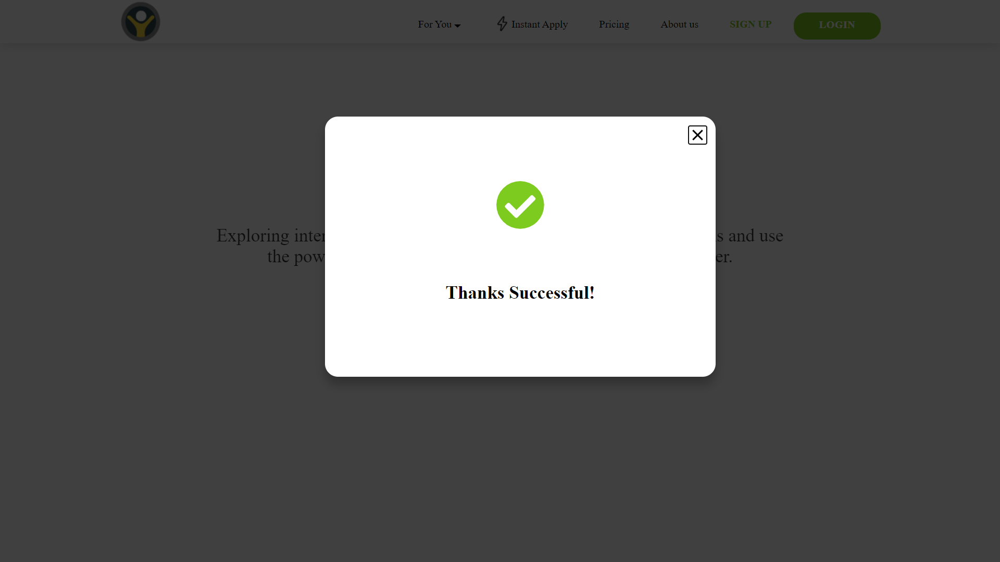
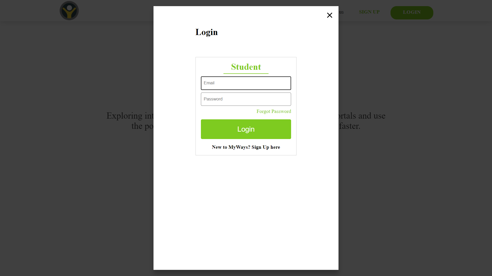
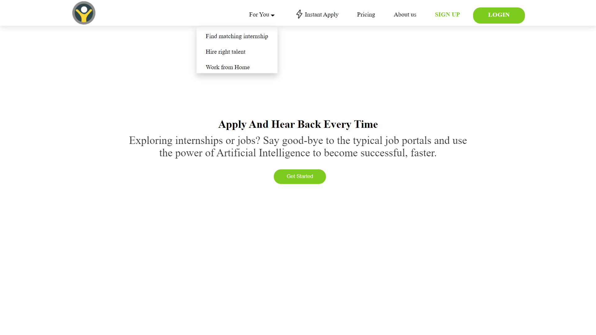

## Steps to setup

1. Create a virtual environment
   ```
   nodeenv --node=14.15.0 env
   ```
2. Start the env
   ```
   cd .\env\Scripts\
   .\Activate.ps1
   ```
3. Install node modules
   ```
   //Back in the app directory
   npm install
   ```
4. Start npm
   ```
   npm start
   ```
# Project Overview

1. Landing Page


2. Sign Up modal


3. Otp Modal


4. Thankyou Modal


5. Login Modal


6. Dropdown

